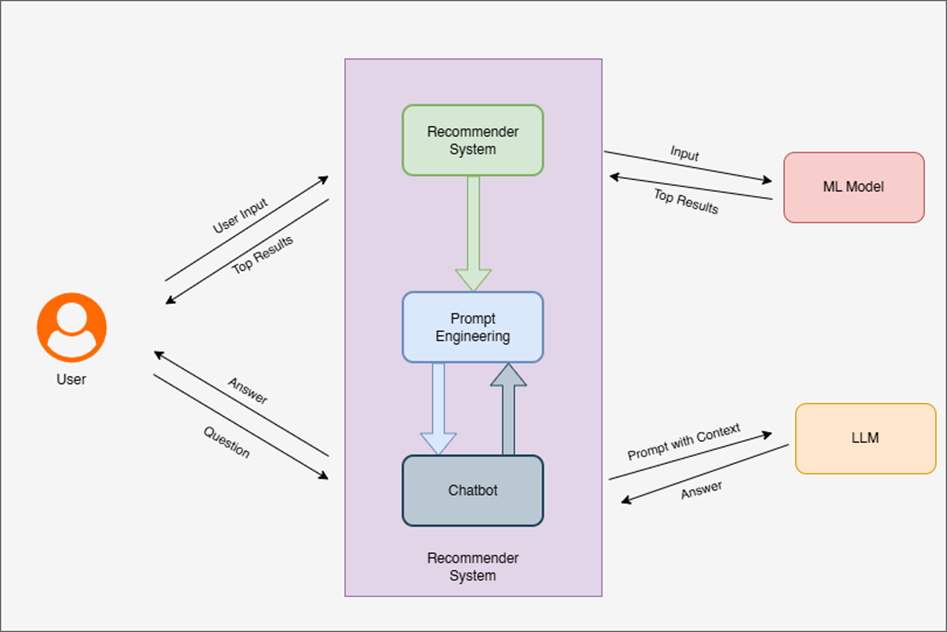
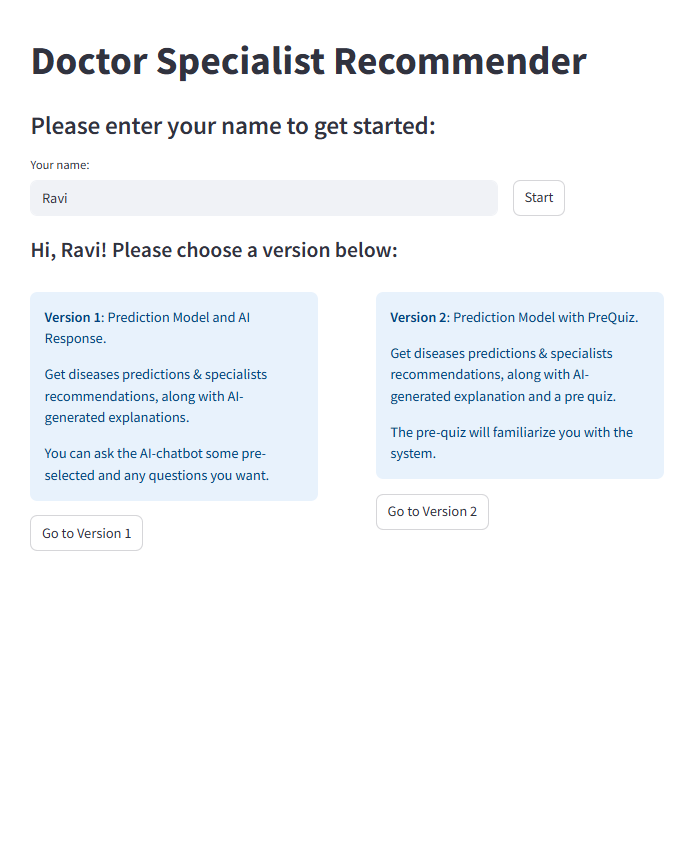
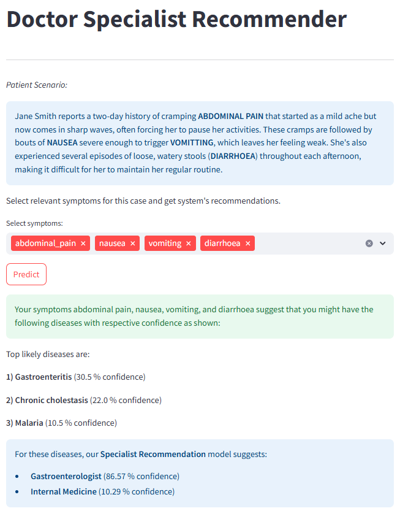
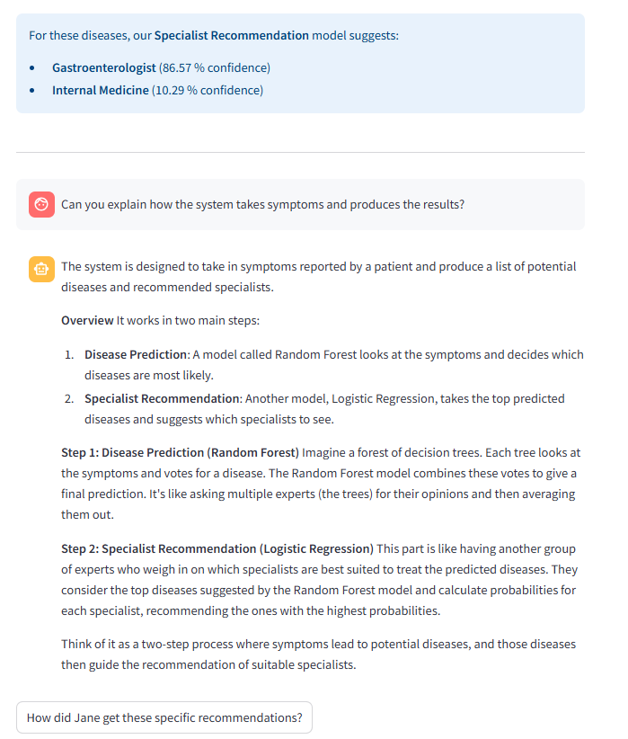
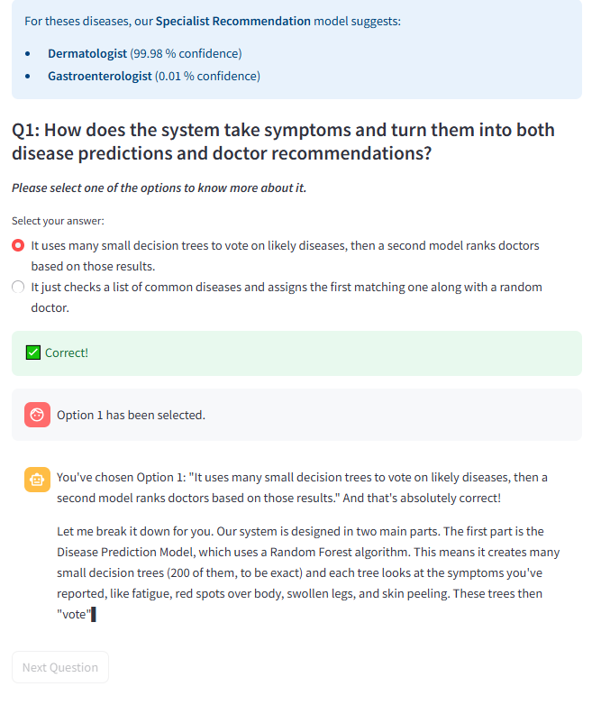

# Doctor-Speciality-Recommender

## **About This Project**

This repository contains the **Doctor Speciality Recommender System**, a web-based application developed for an Explainable AI (XAI) research study. The system predicts the top three likely diseases from user-reported symptoms using a Random Forest model, then recommends two medical specialists using a linear regression model. An integrated LLM-powered chatbot explains the recommendations and answers follow-up questions to support user comprehension.

This app is one of two systems used in a larger XAI study investigating how guided chatbot interactions influence users’ understanding of AI-generated recommendations.

---

## **Study Context**

The broader study evaluates two interaction designs intended to improve users’ comprehension:

* **Version 1: Starter Questions:** Users begin with three predefined questions meant to prime curiosity and guide exploration.
* **Version 2: Quiz-Based Prompts:** Users answer three short quiz questions, and the chatbot explains why each answer is correct or incorrect to encourage deeper reflection.

These two versions are tested in a **2×2 within-subjects factorial design**, using both the Doctor Speciality Recommender and a separate Graduate Advisor Recommender (not included in this repo). Conditions are counterbalanced to minimize ordering effects. Participants complete comprehension quizzes after each interaction and take part in short interviews.

### **Research Objectives**

* **Primary:** Determine whether quiz-based prompts lead to better objective understanding of recommendations compared to starter-question prompts.
* **Secondary:**

  * Assess perceived trust, usefulness, and ease of engagement.
  * Compare whether interaction style effectiveness differs across medical vs. academic domains.
  * Explore qualitative user experiences, including clarity, difficulty, and interaction preferences.

---
## Architecture & Design Overview

### Summary
The Doctor Speciality Recommender is a web application with distinct frontend and backend components that together support symptom input, disease prediction, specialist recommendation, and LLM-driven explanation. The system pipeline is: user → symptom encoder → Random Forest disease predictor → one-hot top-3 disease encoder → multinomial logistic regression specialist recommender → contextual prompt builder → LLM chatbot → user. The app also logs interactions and quiz outcomes to a Supabase backend for study data collection.

## Architecture Diagram



## SETUP

This app is hosted online at:  
**https://xai-doctor-speciality-recommender.streamlit.app/**

The online version is fully functional, database and LLM API are already set up and setup to work with the online deployment.

---

## Running Locally with Custom Database and LLM API

If you wish to run this app offline on your own machine and/or connect it to your own database and LLM API, follow these steps:

### 1. Clone the Repository

```bash
git clone <your-repo-url>
cd Doctor-Speciality-Recommender
```

### 2. Install Python and Dependencies

- Make sure you have Python 3.8+ installed.
- Install dependencies:

```bash
pip install -r requirements.txt
```

### 3. Prepare the Model Files

Ensure the following model files exist in the model directory:

- `disease-model.pkl`
- `symptoms.pkl`
- `specialist-model.pkl`
- `mlb.pkl`

You can add your own models but it will be necessary to change the code to match the architecture of the models you use.

### 4. Set Up the Database

- The app uses Supabase as the backend database.
- You will need to create a Supabase project and set up the required tables (schema will be provided in the repo soon).
- Update the secrets.toml file with your Supabase URL and API key.

### 5. Set Up the LLM API

- The app expects an LLM API endpoint (see `api.url` and `api.model` in sample secrets.toml below).
- Update the secrets.toml file with your API URL and model name.

### 6. Configure Secrets

Edit secrets.toml with your own credentials:

```toml
[api]
url = "<your-llm-api-url>"
model = "<your-llm-model-name>"

[supabase]
url = "<your-supabase-url>"
key = "<your-supabase-key>"

[params]
debug = false
```
NOTE: Debug can be set to true to avoid timers in section (added to ensure study participants spend enough time in different section) and log outputs for debugging.

### 7. Run the App

```bash
streamlit run app.py
```

---

## Notes

- The online version is ready to use with all services configured.
- For local use, you must provide your own database and LLM API endpoints.
- Database schema is available in schema.sql.

---


## **Related Quiz Application**

A separate application handles the quiz portion of the study:
**[https://quiz-doctor-speciality-recommender.streamlit.app/](https://quiz-doctor-speciality-recommender.streamlit.app/)**

GitHub repository:
[https://github.com/ravip5921/DoctorSpecialityRecommender-Quiz](https://github.com/ravip5921/DoctorSpecialityRecommender-Quiz)

---

## Demo screenshots

### Main Menu


### Version 1



### Version 2
